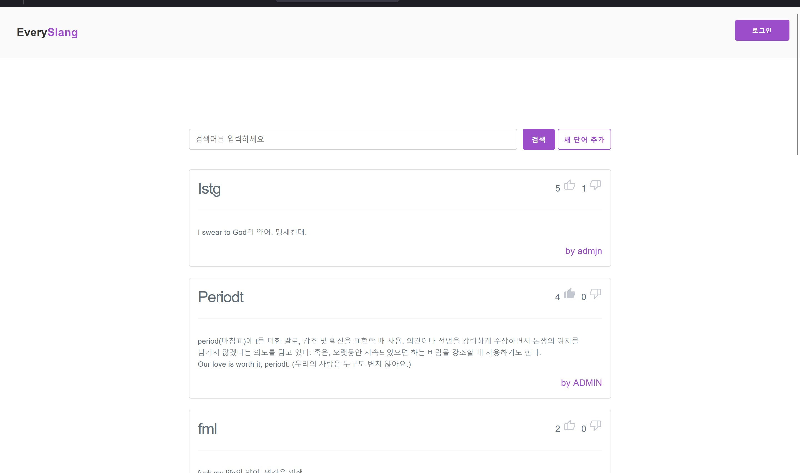

# EverySlang


EverySlang는 한국인을 위한 영어 slang 검색 사이트입니다. 영어 slang를 쉽게 찾고 이해할 수 있도록 돕습니다.

## 설치 및 실행

### 온라인

https://everyslang.com

### 로컬

#### 요구사항

- Git
- Node.js
- 웹 브라우저

1. 터미널에 아래 명령어를 입력하여 프로젝트를 클론합니다.

```bash
git clone https://github.com/your-username/EverySlang.git
```

2. 의존성 패키지를 설치합니다.

```bash
cd EverySlang
npm i
```

3. 로컬 개발 서버를 실행합니다.

```bash
npm run dev
```

4. 웹 브라우저에서 http://localhost:5173/ 에 접속합니다.

## 라이브러리

- [PICO CSS](https://picocss.com/)
- [Vite](https://vitejs.dev/)
- 파비콘: favicon.io

## 라이센스

이 프로젝트는 MIT 라이센스를 따릅니다. 자세한 내용은 [LICENSE](LICENSE) 파일을 참고하세요.
